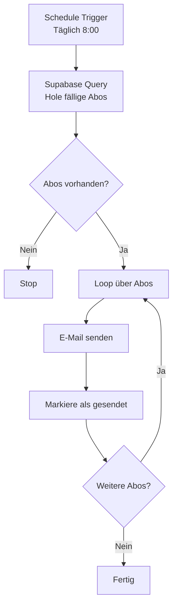

# n8n Workflow für SubTrackr

Automatische E-Mail-Erinnerungen für bald fällige Abo-Zahlungen.

## 📋 Übersicht

Dieser Workflow sendet automatisch E-Mail-Erinnerungen an Benutzer, wenn ihre Abonnements bald abgerechnet werden. Die Erinnerung wird basierend auf dem `reminder_days` Feld für jedes Abo gesendet.

## 🔧 Setup

### 1. Datenbank vorbereiten

Führe das SQL-Script aus, um das `last_reminder_sent` Feld hinzuzufügen:

```bash
# In Supabase SQL Editor ausführen:
sql/add_reminder_tracking.sql
```

### 2. n8n installieren

```bash
# Mit Docker (empfohlen)
docker run -it --rm \
  --name n8n \
  -p 5678:5678 \
  -v ~/.n8n:/home/node/.n8n \
  n8nio/n8n

# Oder mit npm
npm install n8n -g
n8n start
```

### 3. Workflow importieren

1. Öffne n8n: `http://localhost:5678`
2. Gehe zu **Workflows**
3. Klicke auf **Import from File**
4. Wähle `subscription-reminder-workflow.json`

### 4. Credentials konfigurieren

#### A. Supabase PostgreSQL

1. In n8n: **Credentials** → **New** → **Postgres**
2. Name: `Supabase PostgreSQL`
3. Konfiguration:
   ```
   Host: db.[your-project-ref].supabase.co
   Port: 5432
   Database: postgres
   User: postgres
   Password: [your-supabase-db-password]
   SSL: Enable
   ```
4. **Test Connection** → **Save**

**Supabase DB-Passwort finden:**
- Supabase Dashboard → Settings → Database → Connection string
- Oder: Settings → Database → Reset Database Password

#### B. SMTP (E-Mail)

1. In n8n: **Credentials** → **New** → **SMTP**
2. Name: `SMTP Account`
3. Konfiguration (Beispiel mit Gmail):
   ```
   Host: smtp.gmail.com
   Port: 587
   User: deine-email@gmail.com
   Password: [App-spezifisches Passwort]
   Secure: false (für TLS)
   From Email: noreply@subtrackr.app
   From Name: SubTrackr
   ```

**Gmail App-Passwort erstellen:**
1. Google Account → Security → 2-Step Verification
2. App passwords → Generate new
3. Verwende das generierte Passwort

**Alternative SMTP-Anbieter:**
- **SendGrid**: smtp.sendgrid.net:587
- **Mailgun**: smtp.mailgun.org:587
- **AWS SES**: email-smtp.[region].amazonaws.com:587
- **Postmark**: smtp.postmarkapp.com:587

### 5. Workflow aktivieren

1. Öffne den importierten Workflow
2. Klicke auf **Active** (oben rechts)
3. Der Workflow läuft jetzt täglich um 8:00 Uhr

## 📊 Workflow-Logik



### Query-Logik

Der Workflow holt Abos, die:
- ✅ Aktiv sind (`is_active = true`)
- ✅ Heute ihre Erinnerung erhalten sollen (`next_payment_date - reminder_days = TODAY`)
- ✅ Noch keine Erinnerung für diese Zahlung erhalten haben
- ✅ Mit User-E-Mail verknüpft sind (JOIN mit `auth.users`)

### E-Mail Template

Die E-Mail enthält:
- 📧 Betreff: "⏰ Erinnerung: [Abo-Name] wird in [X] Tagen abgerechnet"
- 💰 Betrag und Währung
- 📅 Zahlungsdatum
- 🔗 Link zum Dashboard
- 🎨 Responsives HTML-Design mit SubTrackr-Branding

## 🧪 Testing

### Manuell testen

1. Öffne den Workflow in n8n
2. Klicke auf **Execute Workflow** (oben)
3. Prüfe die Ausführung und Logs

### Test-Daten erstellen

```sql
-- Erstelle ein Test-Abo mit Zahlung in 3 Tagen
INSERT INTO subscriptions (
  user_id,
  name,
  category,
  price,
  currency,
  billing_cycle,
  next_payment_date,
  reminder_days,
  is_active
) VALUES (
  '[your-user-id]',
  'Test Subscription',
  'Other',
  9.99,
  'EUR',
  'monthly',
  CURRENT_DATE + INTERVAL '3 days',
  3,
  true
);
```

### Logs prüfen

- n8n Execution Log: Zeigt jeden Step der Ausführung
- Supabase Logs: Database → Logs
- E-Mail Provider: Check Sent/Delivery Status

## 🔄 Anpassungen

### Schedule ändern

```javascript
// Täglich um 8:00
"0 8 * * *"

// Täglich um 9:00 und 18:00
"0 9,18 * * *"

// Nur Montag bis Freitag um 8:00
"0 8 * * 1-5"

// Jede Stunde
"0 * * * *"
```

### E-Mail anpassen

Bearbeite den `E-Mail senden` Node:
- Subject: Passe den Betreff an
- Message: HTML-Template bearbeiten
- From Email: Absender ändern

### Link zum Dashboard

Ersetze in der E-Mail:
```html
<a href="https://subtrackr.app/dashboard" class="button">
```
Mit deiner tatsächlichen App-URL.

## 🚨 Troubleshooting

### E-Mails kommen nicht an

1. **Prüfe SMTP Credentials**
   - Test Connection in n8n
   - Verifiziere Username/Password

2. **Prüfe Spam-Ordner**
   - E-Mails landen oft im Spam
   - Whitelist die Absender-Adresse

3. **Rate Limits**
   - Gmail: 500 E-Mails/Tag
   - SendGrid Free: 100 E-Mails/Tag
   - Erwäge professionellen SMTP-Service

### Workflow läuft nicht

1. **Ist der Workflow aktiviert?**
   - Active Toggle muss grün sein

2. **Schedule korrekt?**
   - Prüfe Cron-Expression
   - Timezone in n8n Settings

3. **Prüfe Execution Log**
   - Executions Tab in n8n
   - Fehler in einzelnen Nodes

### Keine Daten von Supabase

1. **Database Credentials**
   - Test Connection
   - SSL enabled?

2. **RLS Policies**
   - Postgres-User braucht direkten Zugriff
   - RLS wird umgangen bei direkter DB-Connection

3. **Query testen**
   - Kopiere Query in Supabase SQL Editor
   - Prüfe Syntax und Ergebnisse

## 📈 Erweiterungen

### Mehrere Sprachen

Füge Language-Feld hinzu und wähle E-Mail-Template basierend auf User-Sprache:

```javascript
{{ $json.language === 'de' ? 'Erinnerung' : 'Reminder' }}
```

### Slack-Benachrichtigungen

Füge Slack Node hinzu für Team-Notifications:

```
Neue Erinnerung gesendet an [User] für [Abo]
```

### Webhook für App-Benachrichtigung

Füge HTTP Request Node hinzu:

```javascript
POST https://api.subtrackr.app/notifications
{
  "user_id": "{{ $json.user_id }}",
  "type": "payment_reminder",
  "subscription_id": "{{ $json.id }}"
}
```

### Analytics Tracking

Füge Google Analytics Event hinzu:

```javascript
POST https://www.google-analytics.com/collect
```

## 🔐 Sicherheit

- ✅ Verwende App-spezifische Passwörter (nicht dein Haupt-Passwort)
- ✅ Nutze Umgebungsvariablen für sensible Daten
- ✅ Aktiviere SSL für Supabase Connection
- ✅ Beschränke n8n Zugriff (Firewall, VPN)
- ✅ Regelmäßig Credentials rotieren

## 📝 Wartung

### Wöchentlich
- Prüfe Execution Logs auf Fehler
- Verifiziere E-Mail Delivery Rate

### Monatlich
- Update n8n auf neueste Version
- Prüfe Supabase Logs
- Review sent E-Mails Count

### Bei Problemen
- Check n8n Community Forum
- Supabase Discord
- GitHub Issues

## 📚 Ressourcen

- [n8n Documentation](https://docs.n8n.io/)
- [n8n Community Forum](https://community.n8n.io/)
- [Supabase Docs](https://supabase.com/docs)
- [Cron Expression Generator](https://crontab.guru/)
- [HTML Email Templates](https://github.com/leemunroe/responsive-html-email-template)

## 🆘 Support

Bei Fragen oder Problemen:
- GitHub Issues: [SubTrackr Issues](https://github.com/yourname/subtrackr/issues)
- E-Mail: support@subtrackr.app
- n8n Community: Tag `@subtrackr`
